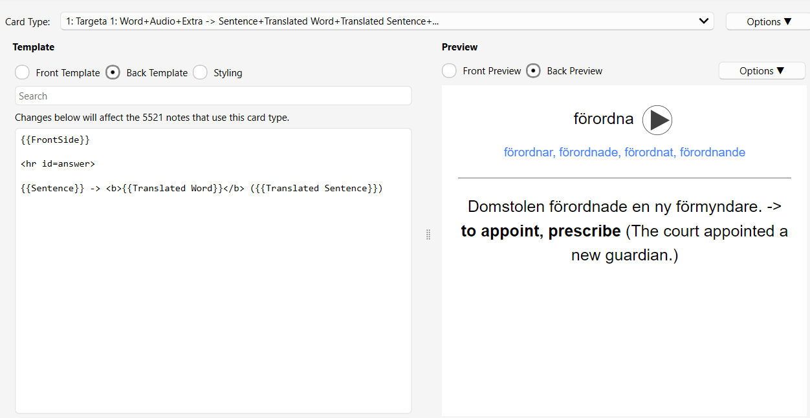

# Swedish A1–C2 Anki Deck

A frequency-based Swedish learning deck for Anki built using AI-generated examples, Azure neural TTS, and automated linguistic enrichment.

## What is Anki?

[Anki](https://apps.ankiweb.net/) is an open-source spaced repetition system (SRS) used for long-term memorization. It is widely used for language learning thanks to its customizable flashcards and adaptive review scheduling.

Access to the deck [here](https://ankiweb.net/shared/info/1992299061).

## Features

- Swedish vocabulary from A1 to C2
- Frequency ordering based on the Kelly list from the Språkbanken corpus (University of Gothenburg)
- AI-generated example sentences using DeepSeek
- Neural audio generated with HyperTTS and Azure Sophie Voice
- Verb conjugations and noun plurals using the Free Dictionary API
- Modular note type with separated fields for easier customization
- Multiple subdecks:
  - Nouns A1–B2
  - Nouns C1–C2
  - Verbs
  - Particle verbs
  - Adjectives
  - Adverbs
  - Pronouns

## Motivation

Most public language-learning decks suffer from inconsistent ordering, missing audio, poor examples, or limited customization.

This project started as a personal attempt to build a more systematic Swedish learning resource while experimenting with:
- APIs
- cloud TTS services
- AI-assisted content generation
- automation workflows
- Anki note engineering

## Included Scripts

Some utility scripts used during the deck creation process are included in this repository.

These scripts are not intended to represent production-quality software. Most were written incrementally and with the help of AI as internal tooling to automate repetitive tasks such as:
- sentence generation
- audio generation
- vocabulary enrichment
- formatting and data cleanup

They are provided mainly for transparency and reproducibility purposes.

## Tech Stack

- Anki
- Python
- DeepSeek
- Microsoft Azure Cognitive Services
- HyperTTS
- Free Dictionary API

## Notes

- Some AI-generated example sentences may contain inaccuracies
- Frequency ordering is not perfect across all categories
- Audio coverage may still be incomplete for rare words

## License

Educational and non-commercial use only unless otherwise specified.
